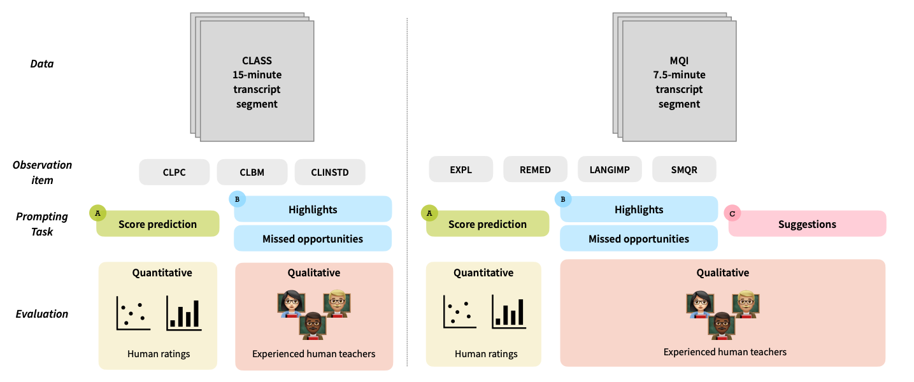

# Is ChatGPT a Good Teacher Coach? Measuring Zero-Shot Performance For Scoring and Providing Actionable Insights on Classroom Instruction

[Project Page](https://rosewang2008.github.io/zero-shot-teacher-feedback/), [Paper](https://arxiv.org/pdf/2306.03090.pdf), [Poster](assets/poster.pdf)

Authors: Rose E. Wang and Dorottya Demszky

In the Proceedings of Innovative Use of NLP for Building Educational Applications 2023

If you find our work useful or interesting, please consider citing it! 

```
@inproceedings{wang2023chatgpt,
  title = {Is ChatGPT a Good Teacher Coach? Measuring Zero-Shot Performance For Scoring and Providing Actionable Insights on Classroom Instruction},
  year = {2023},
  month = jun,
  author = {Wang, Rose and Demszky, Dorottya},
  booktitle = {18th Workshop on Innovative Use of NLP for Building Educational Applications},
  month_numeric = {6}
}
```



## Repository Structure

```
.
├── data                    # Outcome data and annotation data
├── prompts                 # Prompts used for Tasks 
├── results                 # Result plots used in paper
├── scripts                 # Python scripts for analysis
├── requirements.txt        # Install requirements for running code
├── analyze_experiments.sh  # Complete analysis script
├── LICENSE
└── README.md
```

## Transcripts 

*NOTE*: The classroom transcripts are _not_ needed to run the code. However, if you would like to see the transcripts, they can be downloaded following this repository's instructions: [NCTE repository](https://github.com/ddemszky/classroom-transcript-analysis).

The file of interest is called `single_utterances.csv`. You may put that file under this repository as `data/ncte_single_utterances.csv`.

## Installation

To install the required libraries: 

```
conda create -n zero-shot python=3
conda activate zero-shot
pip install -r requirements.txt
```

## Experiments (Replicating Paper Figures)

TLDR: Run `source analyze_experiments.sh` which will launch all the scripts to replicate the paper's figures. The results will be populated under the `results/`

### Task A: Scoring Transcripts

In Table 1, we report the Spearman correlation values between the human scores and model predictions on CLASS and MQI dimensions. We also report the distribution over scores in Figure 4. To re-produce those plots, run
To re-produce, run

```
# Task A: Scoring transcripts
# numerical = DA, numerical_reasoning = RA, numerical_descriptions = DA+
output_types=("numerical" "numerical_reasoning" "numerical_descriptions")

for output_type in "${output_types[@]}"; do
    echo "CLASS on $output_type"
    python3 scripts/class_obs/compare.py --rating_output=$output_type

    echo "MQI on $output_type"
    python3 scripts/mqi_obs/compare.py --rating_output=$output_type
done
```

### Task B: Identify highlights and missed opportunities

In Figure a and b, we report the math teachers' evaluations for highlights and missed opportunities on CLASS and MQI. 
To re-produce those plots, run

```
# Task B: Identify highlights and missed opportunities
python3 scripts/plot_task_bc_results.py --key=class_examples
python3 scripts/plot_task_bc_results.py --key=mqi_examples
```

### Task C: Provide actionable suggestions for eliciting student reasoning 

In Figure c, we report the math teachers' evaluations for the actionable suggestions on eliciting student reasoning.
To re-produce those plots, run

```
# Task C: Provide suggestions
python3 scripts/plot_task_bc_results.py --key=suggestions
```
